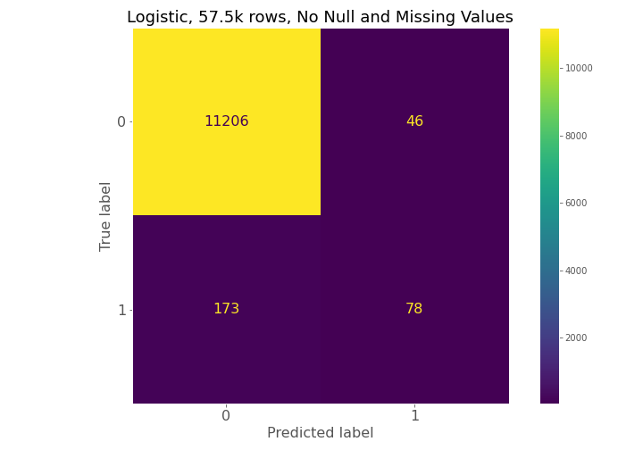
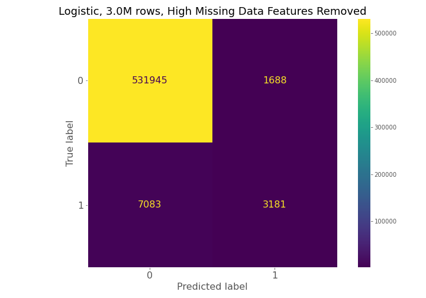
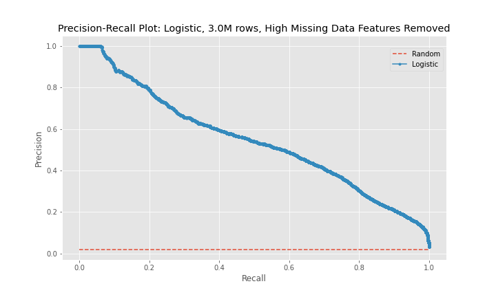
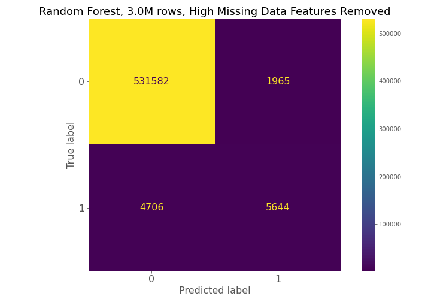

# Predicting COVID-19 Deaths from Publicly Available Data

<p align="center">
  <a href="https://docs.google.com/presentation/d/1ZuryGxy18rZlF7Ga8g-YR7_lhyIDFDDxJe-eabr94FM/edit?usp=sharing">Presentation</a>
</p>

## Table of Contents
- [Background](#background)
- [Reproducing the Project](#reproducing-the-project)
- [Data](#data)
- [Exploratory Data Analysis](#exploratory-data-analysis)
- [Predictive Modeling](#predictive-modeling)
- [Results](#results)
- [Next Steps](#next-steps)

## Background
The COVID-19 pandemic flooded hospitals with a torrent of patients during case surges and overwhelmed the medical industry. At this time, vaccination rates are rising, but the possibility of local surges due to the Delta variant and vaccine hesitancy means hospitals may continue to face surges. During these surges staff are overwhelmed and may need a tool to help diagnose if a patient may die from their COVID-19 infection. By predicting that a patient may die from their infection, hospital staff have time to change treatment, provide targeted increased care, or can suggest experimental treatments in an effort to save a patient's life. The goal of this project is to develop a predictive model from publicly available data to determine if a COVID-19 infected patient will die from their infection with the hope this information will change treatment for the patient and save their life.

## Reproducing the Project
Install a local instance of [PostgreSQL](https://www.postgresql.org/download/) or use an existing instance. Create a database in the instance named `covid_cases` and then run the [`create-covid-db.sql`](https://github.com/jkh-code/predicting-covid-19-deaths/blob/main/sql/create-covid-db.sql) script from the command line to add tables to the database.

Add the following environment variables to use the `make_postgres_conn()` and `make_alchemy_engine()` functions:

```sh
export PG_HOST="my host"
export PG_USER="my user"
export PG_PASSWORD="my password"
```

Add the following path to your Python paths to allow for importing the `make_postgres_conn()` and `make_alchemy_engine()` functions from the *src* folder.

```sh
export PYTHONPATH=$PYTHONPATH:$/my/path/to/predicting-covid-19-deaths/src/
```

## Data
The main dataset for this project comes from the CDC's [COVID-19 Case Surveillance Public Use Data with Geography](https://data.cdc.gov/Case-Surveillance/COVID-19-Case-Surveillance-Public-Use-Data-with-Ge/n8mc-b4w4) dataset. This dataset contains 19 columns, each row is a deidentified patient, and, as of July 12, 2021, this dataset contains 27.1 million rows. Below is a description of the data.

| Field  | Description |
| ------------- | ------------- |
| case_month | Date related to illness received by the CDC. |
| res_state | State of residence of the patient. |
| state_fips_code | State FIPS code. |
| res_county | County of residence of the patient. |
| county_fips_code | County FIPS code. |
| age_group | Age group of the patient. |
| sex | Sex of the patient. |
| race | Race of the patient. |
| ethnicity | Ethnicity of the patient. |
| case_positive_specimen_interval | Weeks between earliest date and date of first positive specimen collected. |
| case_onset_interval | Weeks between earliest date and date of symptom onset. |
| process | How was this case first identified. |
| exposure_yn | If the patient engage in behavior that led to exposure. |
| current_status | Is this a confirmed or probable case of COVID-19. |
| symptom_status | Is the patient asymptomatic or symptomatic. |
| hosp_yn | Was the patient hospitalized? |
| icu_yn | Was the patient admitted to the ICU? |
| death_yn | Did the patient die as a result of the illness? |
| underlying_conditions_yn | Did the patient have one or more underlying conditions? |

The fields above can contain one of four missing data values. The table below describes the four types of missing values a field can have. See the [Predictive Modeling](#predictive-modeling) section for a discussion on how these missing values impacted modeling.

| Missing Value  | Description |
| ------------- | ------------- |
| NA | Suppressed due to privacy. |
| Missing | Jurisdiction did not collect. |
| Unknown | Jurisdiction reported field as unknown. |
| Blank | Jurisdiction did not collect. |

The secondary dataset for this project comes from the U.S. Department of Health and Human Services' [COVID-19 Community Vulnerability Crosswalk by Census Tract](https://healthdata.gov/Health/COVID-19-Community-Vulnerability-Crosswalk-Crosswa/x2y5-9muu) dataset. This dataset contains 19 columns, 72.8 thousand rows, and each row is a census tract in the United States. This dataset contains data on how vulnerable a census tract or county is to COVID-19. For the purposes of this project, county-level low income area score, tribal, and rural data will be extracted. Below are the fields used.

| Field  | Description |
| ------------- | ------------- |
| County FIPS  | Unique ID for each county which will be used for aggregation and joining. |
| Low Income Area (LIA) County SAIPE - Score | Score indicating if if there is low, medium, or high poverty in a county. |
| Tribal Community | A flag indicating if a census tract contains tribal land or not. |
| Rural | A flag indicating if a census tract is rural. |

The tribal community and rural fields was combined into a county-level view. To calculate an estimate of how rural or tribal a county is, the number of census tracts per county were calculated and then the number of rural or tribal census tracts per county were aggregated. Next, the number of rural or tribal census tracts were divided by the total number of census tracts to produce the estimate.

After the community crosswalk data was transformed into county-level data, it was joined to the patient data so that features for the the low income score, percent tribal, and percent rural can be used during the predictive analysis and exploratory data analysis phases of this project.

After review of the available features, the following fields were dropped because they are deemed to not provide much benefit to analysis. A reason for each field is given in the table below.

| Field  | Why Dropped |
| ------------- | ------------- |
| res_county | Identifies a patient's county. Dropped because there are too many counties in the U.S. to provide useful information to the analysis. |
| county_fips_code | Used for joining datasets. Dropped for same reason as res_county. |
| current_status | If case is confirmed COVID or not. Cases filtered to confirmed cases for integrity of analysis and then dropped because all cases are confirmed. |
| process | How was a case identified. This feature cannot impact if a patient will survive COVID. |


## Exploratory Data Analysis
The patient dataset is 27.1 million rows, however, for exploratory data analysis (EDA), a subset of this dataset was used. Only records without missing values in the `death_yn` field were used for EDA because this is the data that would be used during predictive modeling. A sample of 10 million records was extract from the dataset and only 4.4 million records did not have a missing death value. These 4.4 million record were used for EDA.

The number of cases by state is plotted below. Only two of the top five states with the largest populations are in the top 5 states by number of cases and three states with a population between five and 10 million are also in the top 5 states by number of cases.


The two plots below indicate that the majority of cases in the dataset are patients 18 to 49 years old and females are a slightly higher percent of cases.


When race is examined, issues with missing and null values start to appear. The majority of cases in the dataset are White, however, the next two largest percent of cases are NaN (equivalent to NA) and Unknown followed by African-American.


The issue of a significant number of NA, Missing, or Unknown values will appear again for exposure behavior, hospitalization, ICU visit, and underlying conditions.

The majority of cases have exposure behavior missing, with about 13% responding "Yes".


The majority of cases were not hospitalized and the ICU visit feature has an overwhelming majority of missing or unknown values.


The majority of cases have NA for underlying conditions.


In the dataset for EDA, only about 1.2% of cases resulted in deaths.


Exploring the data for percent of null and percent of null, unknown, or missing data, there are some columns with significant missing values. See the table below.

| Feature | % Null | % Null or Missing |
| --- | --- | --- |
| case_month | 0 | 0 |
| res_state | 0 | 0 |
| res_county | 0.02 | 0.02 |
| county_fips_code | 0.02 | 0.02 |
| age_group | 1.88 | 1.93 |
| sex | 5.32 | 5.51 |
| race | 18.58 | 30.82 |
| ethnicity | 22.8 | 39.45 |
| case_positive_specimen_interval | 64.52 | 64.52 |
| case_onset_interval | 40.85 | 40.85 |
| process | 0 | 92.14 |
| exposure_yn | 0 | 87.29 |
| current_status | 0 | 0 |
| symptom_status | 0 | 34.54 |
| hosp_yn | 0 | 31.54 |
| icu_yn | 0 | 89.76 |
| death_yn | 0 | 0 |
| underlying_conditions_yn | 88.44 | 88.44 |
| low_income_score | 0.02 | 0.02 |
| perc_tribal_ct | 0.02 | 0.02 |
| perc_rural_ct | 0.02 | 0.02 |

The exposure behavior, ICU visit, underlying condition, and case positive specimen interval features all have a high percent of null or missing values, and there are several other features that have a high percentage of null or missing values. See the [Predictive Modeling](#predictive-modeling) section for the impact of these null and missing values on the model.

Additional EDA on the percent of different groups that died from their COVID infection are below.


## Predictive Modeling
Due to the high frequency of NA and missing values in the dataset, three sets of data will be created to train models with and the best performing model will be used for predictions. The following three datasets were created:

1. A dataset with no null or missing values.
2. A dataset with null values imputed and missing values unchanged.
3. A dataset with high null or missing value features dropped and null values imputed. The features that will be dropped are:
    - Exposure behavior
    - ICU visit
    - Underlying conditions
    - Case positive specimen interval

Dataset (1) has 57.5k observations, dataset (2) has 203k observations, and dataset (3) has 13.2 million observations, but only 3 million observations were used in the [Results](#results) section below.

For each dataset a logistic regression and random forest model will be used to predict if a patient dies from their COVID infection. Recall will be used to judge each model because predicting death will be the positive class and recall is a measure of the true positive rate.


## Results

### Logistic Regression Models
While the precision of the logistic regression models was between 63-76%, the recall, the main metric used to judge the effectiveness of the models, remained between 31-38%. In addition, the model using the third dataset performed worse than the model for the second dataset.
  
Metric | Model 1 | Model 2 | Model 3 |
| --- | --- | --- | --- |
| Recall | 31.1% | 38.3% | 31.0% |
| Precision | 62.9% | 76.1% | 65.3% |

From examining the confusion matrices for each model, each model had high true negative prediction but also had high false negative predictions compared to true positives.






The precision-recall curves show that model 2 is a better predictor than model 1 and that model 3 is worse predictor than model 2. The curves for model 1 and model 3 are near diagonal lines for the entire span of the graph. The curve for model 2 is also near diagonal, however, for a recall between 0-20%, the curve is higher for longer than the other two models, which explains model 2's better performance.




### Random Forest Models
From the metrics in the table below, metric 3 is the best random forest model for the given situation. While the precision is high, the recall is still relatively low with a value of 54.4%. This means that there is still a significant number of false negatives being predicted by the model, which is undesirable because that means patients that will die are not being detected and cannot be provided alternative treatment.
  
| Metric | Model 1 | Model 2 | Model 3 |
| --- | --- | --- | --- |
| Recall | 43.4% | 48.6% | 54.5% |
| Precision | 53.2% | 70.4% | 74.2% |

The confusion matrices constantly show for model 1, model 2, and model 3 that a high number of true negatives are accurately detected, but a large number of false negatives are also being predicted relative to the number of true positives.




The progression of the precision-recall curves from a near diagonal line for model 1 to a more bowed curve with the hump of the curve gravitating toward the upper-right corner of the graph for model 3 show that model 3 is the best model of the random forest models, and the best model between the logistic regression and random forest model groups.


Feature importance graphs determined through mean decrease in impurity for all three models are below. For the best model, model 3, the 65+ age group, coming from a rural community, and being hospitalized are key indicators of dying from a COVID-19 infection.


### Summary
- The random Forest model for high NA/missing features removed dataset has the best recall.
- The recall of the model still needs improvement due to the high false negatives.
- Based on mean decrease impurity the 3 most important features are:
    - The 65+ age group,
    - Residing in a rural area, and
    - Being hospitalized


## Next Steps
- Use the Random Forest model for high NA/missing features removed dataset.
- Balance classes using oversampling.
- Hypertune parameters.
- Use shap package to determine feature importance.
- Consider removing state from dataset as states that have more comprehensive data collection programs may cause the state to show up in feature importance.
